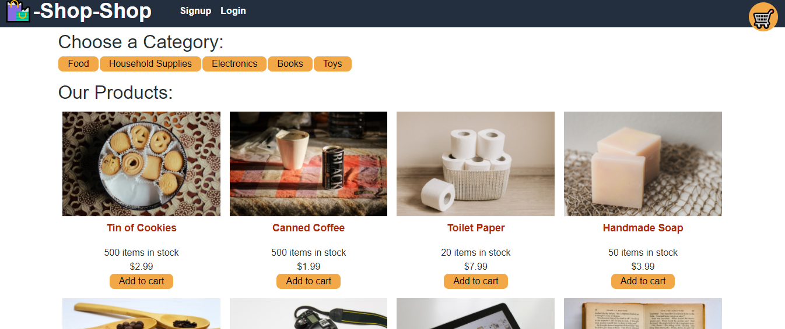

  # Title
  Shop-Shop

  ## Username
  fgutierrez2191

  ## Description
    Shop-Shop is an e-commerce application that can be used to buy items from many different categories. This project uses the MERN stack and Redux for Global State Management.

  ## Contributors
  Felix Gutierrez

  ## Technologies
  MongoDb, Express.js, React.js and Node.js

  ## License
  undefined

  ## Screenshot

  ## *For Questions*
  contact:[fgutierrez2191@icloud.com]

  Github:[(https://github.com/fgutierrez2191)]
